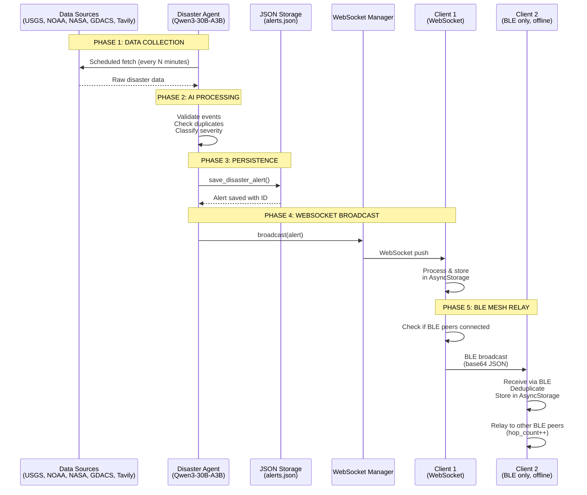
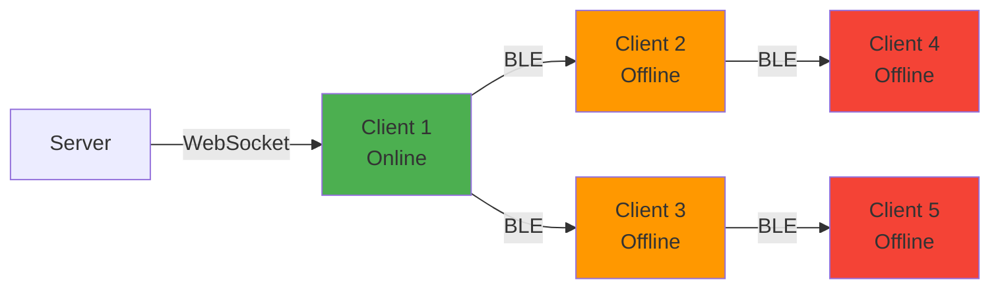

# Data Flow

This page documents the complete journey of a disaster alert through the Sift system, from initial detection to delivery on mobile devices via WebSocket or BLE mesh.

---

## End-to-End Flow Overview



---

## Phase 1: Data Collection from Sources

### Source APIs Called

The disaster agent calls 4 official APIs on every scheduled run:

<Steps>
  <Step title="USGS Earthquakes">
    **Endpoint:** `https://earthquake.usgs.gov/earthquakes/feed/v1.0/summary/4.5_hour.geojson`
    
    **Data structure:**
    ```json
    {
      "type": "FeatureCollection",
      "features": [
        {
          "type": "Feature",
          "properties": {
            "mag": 5.2,
            "place": "42 km NE of Tokyo, Japan",
            "time": 1709424000000,
            "url": "https://earthquake.usgs.gov/earthquakes/eventpage/..."
          },
          "geometry": {
            "type": "Point",
            "coordinates": [139.6917, 35.7090, 10.5]
          }
        }
      ]
    }
    ```
    
    **Extracted fields:**
    - `magnitude` (mag)
    - `place` (location description)
    - `lat, lng, depth_km` (from coordinates)
    - `time_ms` (Unix timestamp)
    
    **Location:** `server/app/services/data_sources.py:21`
  </Step>

  <Step title="NOAA Weather Alerts">
    **Endpoint:** `https://api.weather.gov/alerts/active?status=actual&message_type=alert`
    
    **Filter:** Only `Extreme`, `Severe`, or `Moderate` severity
    
    **Data structure:**
    ```json
    {
      "features": [
        {
          "properties": {
            "event": "Flash Flood Warning",
            "severity": "Severe",
            "areaDesc": "Harris County, TX",
            "headline": "Flash Flood Warning issued...",
            "onset": "2026-03-02T12:00:00-06:00"
          },
          "geometry": {
            "type": "Polygon",
            "coordinates": [[[...]]]
          }
        }
      ]
    }
    ```
    
    **Processing:**
    - Calculate polygon centroid for lat/lng
    - Map NOAA event type to Sift alert type (flood, storm, fire, etc.)
    - Map severity: Extreme→critical, Severe→high, Moderate→medium
    
    **Location:** `server/app/services/data_sources.py:57`
  </Step>

  <Step title="NASA EONET">
    **Endpoint:** `https://eonet.gsfc.nasa.gov/api/v3/events?status=open&days=1&limit=20`
    
    **Data structure:**
    ```json
    {
      "events": [
        {
          "id": "EONET_12345",
          "title": "Wildfire - California, USA",
          "categories": [{"id": "wildfires", "title": "Wildfires"}],
          "geometry": [
            {
              "date": "2026-03-02T00:00:00Z",
              "type": "Point",
              "coordinates": [-120.5, 37.8]
            }
          ]
        }
      ]
    }
    ```
    
    **Processing:**
    - Extract latest geometry from array
    - Map EONET category to Sift alert type
    - Use most recent coordinate update
    
    **Location:** `server/app/services/data_sources.py:138`
  </Step>

  <Step title="GDACS Global Alerts">
    **Endpoint:** `https://www.gdacs.org/xml/rss.xml` (RSS feed)
    
    **Filter:** Only `Red` or `Orange` alert levels
    
    **Data structure (RSS):**
    ```xml
    <item>
      <title>Red alert: Earthquake M6.8 Japan</title>
      <gdacs:alertlevel>Red</gdacs:alertlevel>
      <geo:lat>35.7</geo:lat>
      <geo:long>139.7</geo:long>
      <link>https://www.gdacs.org/report.aspx?...</link>
    </item>
    ```
    
    **Processing:**
    - Parse RSS feed with `feedparser`
    - Extract alert level from custom namespace or title
    - Map Red→critical, Orange→high
    - Infer alert type from title (earthquake, flood, cyclone, etc.)
    
    **Location:** `server/app/services/data_sources.py:193`
  </Step>

  <Step title="Tavily Web Search (Optional)">
    **SDK:** `tavily-python`
    
    **Trigger:** Always called once per run for recent disaster news
    
    **Example query:** `"chemical plant explosion Texas today 2026"`
    
    **Trusted domains filter:**
    - reuters.com, apnews.com, bbc.com, bbc.co.uk
    - usgs.gov, noaa.gov, weather.gov, gdacs.org
    - nasa.gov, fema.gov, cdc.gov, who.int
    - theguardian.com, npr.org
    
    **Data structure:**
    ```json
    {
      "query": "chemical plant explosion Texas today",
      "results": [
        {
          "title": "Chemical Plant Explosion in Houston...",
          "content": "A major chemical plant explosion...",
          "url": "https://www.reuters.com/..."
        }
      ]
    }
    ```
    
    **Location:** `server/app/services/disaster_agent.py:388`
  </Step>
</Steps>

---

## Phase 2: AI Agent Processing

### Agent Execution Loop

The disaster agent uses a **function calling loop** with up to 25 iterations:

<CodeGroup>
```python Agent Loop (server/app/services/disaster_agent.py:271)
for iteration in range(25):
    response = client.chat.completions.create(
        model="Qwen3-30B-A3B",
        messages=messages,
        tools=TOOLS,  # 6 function tools
        tool_choice="auto",
        max_tokens=4096,
        temperature=0.1,
    )
    
    msg = response.choices[0].message
    
    if not msg.tool_calls:
        # Agent finished — no more tools to call
        break
    
    for tool_call in msg.tool_calls:
        name = tool_call.function.name
        args = json.loads(tool_call.function.arguments)
        
        result = await self._execute_tool(name, args)
        
        # Append tool result to conversation
        messages.append({
            "role": "tool",
            "tool_call_id": tool_call.id,
            "content": json.dumps(result),
        })
```
</CodeGroup>

### Decision Logic: Save Criteria

The agent decides whether to call `save_disaster_alert()` based on:

<AccordionGroup>
  <Accordion title="✓ Event is REAL (from official API or confirmed news)">
    - Data from USGS, NOAA, NASA EONET, GDACS automatically qualifies
    - Web search results from trusted domains (Reuters, AP, BBC, etc.)
    - NOT test messages, exercises, or unverified social media
  </Accordion>

  <Accordion title="✓ Event is CURRENT (occurred within last 6 hours)">
    - USGS: `time_ms` field (Unix timestamp)
    - NOAA: `onset` field (ISO 8601 timestamp)
    - NASA EONET: `date` field in geometry
    - GDACS: RSS `pubDate` or inferred from title
    - Web search: Publication date from article metadata
    
    **Cutoff:** Current UTC time - 6 hours
  </Accordion>

  <Accordion title="✓ Event is SIGNIFICANT (severity ≥ medium)">
    **Severity guide (from tool description):**
    
    | Event Type | Medium | High | Critical |
    |------------|--------|------|----------|
    | Earthquake | M4.5-5.0 | M5.0-6.0 | M6.0+ |
    | Weather (NOAA) | Moderate | Severe | Extreme |
    | Hurricane | - | Cat 1-2 | Cat 3+ |
    | Wildfire | - | >1000 acres | Out of control |
    | Tsunami | - | Watch | Warning |
    | Flood | Advisory | Flash flood warning | - |
    
    **Location:** `server/app/services/disaster_agent.py:138` (tool parameter description)
  </Accordion>

  <Accordion title="✓ NOT a DUPLICATE (same type within 50km and 2 hours)">
    **Deduplication logic:**
    ```python
    def _is_duplicate(self, alert_type: str, lat: float, lng: float, hours: int = 2) -> bool:
        since = datetime.now(timezone.utc) - timedelta(hours=hours)
        for alert in storage.get_all_alerts():
            if alert.get("type") != alert_type:
                continue  # Different types are NOT duplicates
            if alert["created_at"] < since:
                continue  # Too old to be duplicate
            if _distance_km(lat, lng, alert["lat"], alert["lng"]) < 50.0:
                return True  # Duplicate found!
        return False
    ```
    
    **Key insight:** Different event types in the same location are NOT duplicates
    - Earthquake + Tsunami in same area → both saved
    - Two earthquakes within 50km and 2 hours → duplicate (only first saved)
    
    **Location:** `server/app/services/disaster_agent.py:479`
  </Accordion>
</AccordionGroup>

### Example Agent Execution

<Steps>
  <Step title="Iteration 1: Fetch USGS">
    **Agent calls:** `fetch_usgs_earthquakes()`
    
    **Result:**
    ```json
    {
      "count": 3,
      "events": [
        {"source": "USGS", "type": "earthquake", "magnitude": 5.2, "place": "Japan", "lat": 35.7, "lng": 139.7},
        {"source": "USGS", "type": "earthquake", "magnitude": 4.8, "place": "Chile", "lat": -33.4, "lng": -70.6},
        {"source": "USGS", "type": "earthquake", "magnitude": 4.6, "place": "Indonesia", "lat": -2.5, "lng": 118.0}
      ]
    }
    ```
  </Step>

  <Step title="Iteration 2-4: Fetch NOAA, NASA, GDACS">
    Agent calls remaining data source functions in sequence
  </Step>

  <Step title="Iteration 5: Web Search">
    **Agent calls:** `search_web(query="chemical plant explosion Texas 2026")`
    
    **Result:** List of news articles from trusted sources (or empty if no results)
  </Step>

  <Step title="Iteration 6+: Save Qualifying Alerts">
    **Agent calls:** `save_disaster_alert()` for EACH qualifying event
    
    **Example call:**
    ```json
    {
      "type": "earthquake",
      "severity": "high",
      "title": "M5.2 Earthquake near Tokyo, Japan",
      "description": "A magnitude 5.2 earthquake struck 42km northeast of Tokyo at depth 10.5km.",
      "city": "Tokyo",
      "state": "Tokyo Prefecture",
      "lat": 35.7090,
      "lng": 139.6917,
      "data_source": "USGS"
    }
    ```
    
    **Agent makes ONE call per event** (not batched)
  </Step>

  <Step title="Final Iteration: Summary">
    **Agent output (no tool calls):**
    
    > "Scan complete. Checked USGS, NOAA, NASA EONET, GDACS, and web search. Found 2 qualifying events: M5.2 earthquake in Japan (high severity) and flash flood warning in Texas (high severity). Both saved and broadcast to connected clients."
    
    **Loop exits** — run complete
  </Step>
</Steps>

---

## Phase 3: Alert Persistence

### Save to JSON Storage

When the agent calls `save_disaster_alert()`, the following happens:

<CodeGroup>
```python server/app/services/storage.py:48
def add_alert(alert: dict) -> dict:
    alerts = _load(ALERTS_FILE)  # Read alerts.json
    now = datetime.now(timezone.utc).isoformat()
    
    # Set defaults
    alert.setdefault("id", str(uuid.uuid4()))
    alert.setdefault("active", True)
    alert.setdefault("created_at", now)
    alert.setdefault("updated_at", now)
    alert.setdefault("source", "agent")
    
    alerts.append(alert)
    _save(ALERTS_FILE, alerts)  # Write back to JSON
    
    logger.info(f"[storage] Alert saved: [{alert['severity'].upper()}] {alert['type']} — {alert['title']}")
    return alert
```

```json Example alerts.json
[
  {
    "id": "a1b2c3d4-e5f6-7890-abcd-ef1234567890",
    "type": "earthquake",
    "severity": "high",
    "title": "M5.2 Earthquake near Tokyo, Japan",
    "description": "A magnitude 5.2 earthquake struck 42km northeast of Tokyo at depth 10.5km.",
    "city": "Tokyo",
    "state": "Tokyo Prefecture",
    "lat": 35.7090,
    "lng": 139.6917,
    "source": "USGS",
    "active": true,
    "created_at": "2026-03-02T14:32:15.123456+00:00",
    "updated_at": "2026-03-02T14:32:15.123456+00:00"
  }
]
```
</CodeGroup>

**File location:** `server/data/alerts.json` (created at runtime if doesn't exist)

---

## Phase 4: WebSocket Broadcast

### Real-Time Push to Connected Clients

Immediately after saving to JSON, the agent broadcasts the alert to all connected WebSocket clients:

<CodeGroup>
```python server/app/services/disaster_agent.py:452
if self.ws_manager:
    asyncio.create_task(
        self.ws_manager.broadcast({
            "event": "alert:new",
            "alert": {
                "id": alert["id"],
                "type": alert["type"],
                "severity": alert["severity"],
                "title": alert["title"],
                "lat": alert["lat"],
                "lng": alert["lng"],
                "city": alert.get("city"),
                "state": alert.get("state"),
                "source": alert["source"],
            },
        })
    )
```

```python server/app/main.py:50 (WebSocket Manager)
async def broadcast(self, data: dict):
    dead = []
    for ws in self._connections:
        try:
            await ws.send_json(data)  # Send to each client
        except Exception:
            dead.append(ws)  # Mark for cleanup
    for ws in dead:
        self._connections.remove(ws)
```
</CodeGroup>

### Client Reception

<CodeGroup>
```javascript Client/src/services/websocketService.js:97
ws.onmessage = (event) => {
  const payload = JSON.parse(event.data);
  const eventType = payload?.event;
  
  if (eventType === 'alert' || eventType === 'alert:new') {
    let alert = payload.alert ?? payload.data;
    
    // Ensure alert has ID
    if (alert && !alert.id && payload?.alertId) {
      alert = { ...alert, id: payload.alertId };
    }
    
    if (alert && this._onAlert) {
      this._onAlert(alert);  // Pass to alert service
    }
  }
};
```
</CodeGroup>

**Flow:**
1. WebSocket receives JSON message
2. Parse `event` field to identify as `alert:new`
3. Extract `alert` object from payload
4. Pass to `alertService.processAlert()`
5. Alert service deduplicates, stores in AsyncStorage, and broadcasts to BLE peers

---

## Phase 5: BLE Mesh Relay

### Client-to-Client Propagation

When a client receives an alert (via WebSocket OR BLE), it relays to BLE peers:



### BLE Alert Format

<CodeGroup>
```javascript Client broadcasts to BLE peers
{
  "id": "a1b2c3d4-e5f6-7890-abcd-ef1234567890",
  "type": "earthquake",
  "severity": "high",
  "title": "M5.2 Earthquake near Tokyo, Japan",
  "description": "A magnitude 5.2 earthquake struck 42km northeast of Tokyo at depth 10.5km.",
  "city": "Tokyo",
  "state": "Tokyo Prefecture",
  "lat": 35.7090,
  "lng": 139.6917,
  "source": "USGS",
  "relayed_by": "device-uuid-client-1",
  "hop_count": 1
}
```
</CodeGroup>

**Encoding:** JSON → UTF-8 → Base64 (for BLE transmission)

### Deduplication on Receive

Each client deduplicates incoming alerts by ID:

```javascript
// Check if alert already exists in AsyncStorage
const existingAlerts = await AsyncStorage.getItem('alerts');
const alerts = JSON.parse(existingAlerts || '[]');

if (alerts.some(a => a.id === incomingAlert.id)) {
  console.log('Duplicate alert — ignoring');
  return;
}

// New alert — store and relay
alerts.push(incomingAlert);
await AsyncStorage.setItem('alerts', JSON.stringify(alerts));

// Broadcast to BLE peers (if not already at max hop count)
if (incomingAlert.hop_count < MAX_HOP_COUNT) {
  await bluetoothService.broadcastAlert({
    ...incomingAlert,
    relayed_by: myDeviceId,
    hop_count: (incomingAlert.hop_count || 0) + 1,
  });
}
```

**Location:** `Client/src/services/alertService.js` (exact implementation may vary)

### BLE Write Operation

<CodeGroup>
```javascript Client/src/services/bluetoothService.js:161
async broadcastAlert(alert) {
  if (this._connectedDevices.size === 0) {
    return;  // No peers connected
  }
  
  const payload = JSON.stringify(alert);
  const base64 = this._toBase64(payload);
  
  for (const [id, { device }] of this._connectedDevices) {
    try {
      await device.writeCharacteristicWithoutResponseForService(
        SERVICE_UUID,
        CHARACTERISTIC_UUID,
        base64
      );
    } catch (e) {
      // Handle disconnection
      if (e.message.includes('not connected')) {
        this._connectedDevices.delete(id);
      }
    }
  }
}
```
</CodeGroup>

---

## Data Flow Timing

### Typical Latencies

| Stage | Latency | Notes |
|-------|---------|-------|
| **Agent fetch (4 APIs)** | 2-5 seconds | Parallel async calls |
| **AI processing** | 10-30 seconds | Depends on # of events and iterations |
| **JSON save** | Under 50ms | Local file write |
| **WebSocket broadcast** | 10-100ms | Per connected client |
| **Client receive → AsyncStorage** | 50-200ms | JSON parse + storage write |
| **BLE broadcast** | 100-500ms | Per connected peer device |
| **Total (source → client)** | **15-40 seconds** | Dominated by AI processing |

### Scheduled Agent Runs

<CodeGroup>
```python Example: 30-minute interval
# First run: Immediate (on server startup)
# Subsequent runs: Every 30 minutes

00:00 UTC — Server starts → Agent run 1 (immediate)
00:30 UTC — Agent run 2
01:00 UTC — Agent run 3
01:30 UTC — Agent run 4
...
```
</CodeGroup>

**Configuration:** `AGENT_INTERVAL_MINUTES` environment variable

---

## Error Handling in Data Flow

<AccordionGroup>
  <Accordion title="API Fetch Failures">
    **Scenario:** USGS API times out or returns 500 error
    
    **Handling:**
    - Exception caught in `fetch_usgs_earthquakes()`
    - Logs error: `[data_sources][USGS] Error: {exception}`
    - Returns empty list: `return []`
    - Agent continues to next source (NOAA, NASA, GDACS)
    
    **Impact:** Partial data collection (other sources still work)
    
    **Location:** `server/app/services/data_sources.py:52`
  </Accordion>

  <Accordion title="Duplicate Detection False Negative">
    **Scenario:** Two similar earthquakes 49km apart saved as separate alerts
    
    **Handling:**
    - Both alerts saved (within deduplication threshold)
    - Users see two nearby alerts
    - Future enhancement: cluster nearby events in UI
    
    **Impact:** Minor — slightly redundant alerts
  </Accordion>

  <Accordion title="WebSocket Connection Drop">
    **Scenario:** Client loses internet connection mid-alert delivery
    
    **Handling:**
    - Server: `ws.send_json()` throws exception → client added to `dead` list → removed from `_connections`
    - Client: `ws.onclose` triggered → `_scheduleReconnect()` called → reconnect after 5 seconds
    - On reconnect: Client fetches missed alerts via `GET /api/alerts?hours=1`
    
    **Impact:** Brief delay, no data loss
    
    **Locations:**
    - Server: `server/app/main.py:54`
    - Client: `Client/src/services/websocketService.js:123`
  </Accordion>

  <Accordion title="BLE Connection Timeout">
    **Scenario:** Device moves out of BLE range during alert broadcast
    
    **Handling:**
    - `writeCharacteristicWithoutResponseForService()` throws timeout exception
    - Device removed from `_connectedDevices` map
    - Alert delivery skipped for that peer
    
    **Impact:** Alert not relayed to out-of-range peer (expected behavior)
    
    **Location:** `Client/src/services/bluetoothService.js:179`
  </Accordion>

  <Accordion title="Agent Run Takes Too Long">
    **Scenario:** Agent run exceeds interval time (e.g., 40-minute run with 30-minute interval)
    
    **Handling:**
    - `agent_status["running"]` flag prevents concurrent runs
    - Scheduler skips missed run (graceful degradation)
    - Logs warning: `Previous run still in progress — skipping`
    
    **Impact:** Delayed next run, but no crashes or duplicate processing
    
    **Location:** `server/app/services/disaster_agent.py:233`
  </Accordion>
</AccordionGroup>

---

## Data Schemas in Flow

### Alert Schema Evolution

<Steps>
  <Step title="Source API Format">
    **Example (USGS):**
    ```json
    {
      "mag": 5.2,
      "place": "42 km NE of Tokyo, Japan",
      "time": 1709424000000,
      "coordinates": [139.6917, 35.7090, 10.5]
    }
    ```
  </Step>

  <Step title="Agent Function Call">
    **Tool call to `save_disaster_alert()`:**
    ```json
    {
      "type": "earthquake",
      "severity": "high",
      "title": "M5.2 Earthquake near Tokyo, Japan",
      "description": "A magnitude 5.2 earthquake struck...",
      "city": "Tokyo",
      "state": "Tokyo Prefecture",
      "lat": 35.7090,
      "lng": 139.6917,
      "data_source": "USGS"
    }
    ```
  </Step>

  <Step title="Stored in JSON (alerts.json)">
    **After storage enrichment:**
    ```json
    {
      "id": "uuid",
      "type": "earthquake",
      "severity": "high",
      "title": "M5.2 Earthquake near Tokyo, Japan",
      "description": "A magnitude 5.2 earthquake struck...",
      "city": "Tokyo",
      "state": "Tokyo Prefecture",
      "lat": 35.7090,
      "lng": 139.6917,
      "source": "USGS",
      "active": true,
      "created_at": "2026-03-02T14:32:15+00:00",
      "updated_at": "2026-03-02T14:32:15+00:00"
    }
    ```
  </Step>

  <Step title="WebSocket Broadcast">
    **Sent to clients:**
    ```json
    {
      "event": "alert:new",
      "alert": {
        "id": "uuid",
        "type": "earthquake",
        "severity": "high",
        "title": "M5.2 Earthquake near Tokyo, Japan",
        "lat": 35.7090,
        "lng": 139.6917,
        "city": "Tokyo",
        "state": "Tokyo Prefecture",
        "source": "USGS"
      }
    }
    ```
    
    **Note:** Description omitted from broadcast for size (full data available via REST API)
  </Step>

  <Step title="BLE Relay (with hop tracking)">
    **Broadcast to BLE peers:**
    ```json
    {
      "id": "uuid",
      "type": "earthquake",
      "severity": "high",
      "title": "M5.2 Earthquake near Tokyo, Japan",
      "description": "A magnitude 5.2 earthquake struck...",
      "city": "Tokyo",
      "state": "Tokyo Prefecture",
      "lat": 35.7090,
      "lng": 139.6917,
      "source": "USGS",
      "relayed_by": "device-uuid-client-1",
      "hop_count": 1
    }
    ```
    
    **Encoding:** Base64-encoded JSON over BLE GATT characteristic
  </Step>
</Steps>

---

## Performance Optimizations

<CardGroup cols={2}>
  <Card title="Parallel API Fetching" icon="bolt">
    All 4 data source APIs fetched in parallel using async/await:
    
    ```python
    # NOT sequential:
    # fetch_usgs() → fetch_noaa() → fetch_nasa() → fetch_gdacs()
    
    # Parallel (agent calls tools, executor runs them concurrently):
    asyncio.gather(
        fetch_usgs_earthquakes(),
        fetch_noaa_alerts(),
        fetch_nasa_eonet(),
        fetch_gdacs_alerts(),
    )
    ```
    
    **Speedup:** 2-5 seconds (vs. 8-15 seconds sequential)
  </Card>

  <Card title="WebSocket Broadcasting" icon="tower-broadcast">
    Non-blocking async broadcast to all clients:
    
    ```python
    asyncio.create_task(ws_manager.broadcast(alert))
    ```
    
    **Benefit:** Agent doesn't wait for client delivery (fire-and-forget)
  </Card>

  <Card title="BLE Write Without Response" icon="bluetooth">
    Uses `writeCharacteristicWithoutResponseForService()` instead of write-with-response:
    
    **Benefit:** No ACK wait from peer device (faster, lower latency)
    
    **Trade-off:** No delivery confirmation (acceptable for disaster alerts)
  </Card>

  <Card title="In-Memory Alert Cache" icon="memory">
    **Future optimization:** Cache recent alerts in memory to avoid JSON file reads on every deduplication check
    
    **Current:** Re-reads `alerts.json` on every `_is_duplicate()` call
  </Card>
</CardGroup>

---

## Next Steps

<CardGroup cols={2}>
  <Card title="Architecture Overview" icon="sitemap" href="/architecture/overview">
    High-level system architecture and component interaction
  </Card>

  <Card title="Tech Stack" icon="layer-group" href="/architecture/tech-stack">
    Detailed breakdown of all technologies, libraries, and APIs
  </Card>
</CardGroup>