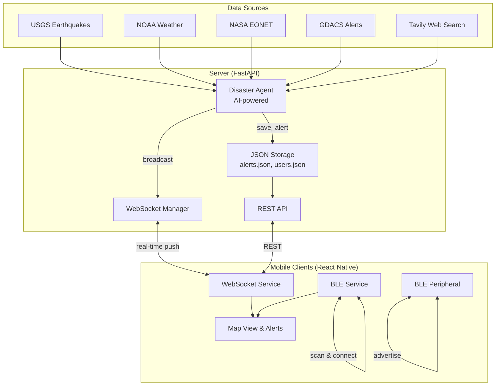

# Architecture Overview

Sift is a full-stack disaster alert relay system that aggregates alerts from multiple sources, enriches them with AI, and delivers them to mobile clients over the internet or via Bluetooth mesh when connectivity is limited.

## System Architecture



## Core Components

### Server Components

<CardGroup cols={2}>
  <Card title="Disaster Agent" icon="robot">
    AI-powered autonomous agent that runs on a scheduled interval (configurable, default: every N minutes) to:
    - Fetch alerts from 4 official APIs (USGS, NOAA, NASA EONET, GDACS)
    - Search web for recent disaster news via Tavily
    - Deduplicate events within 50km radius and 2-hour window
    - Validate and save qualifying alerts
    - Broadcast new alerts via WebSocket
    
    **Location:** `server/app/services/disaster_agent.py:217`
  </Card>

  <Card title="WebSocket Manager" icon="tower-broadcast">
    Manages persistent WebSocket connections for real-time alert delivery:
    - One connection per device (enforced by `device_id`)
    - Broadcasts new alerts to all connected clients
    - Handles reconnection logic
    - Updates user connection status
    
    **Location:** `server/app/main.py:24`
  </Card>

  <Card title="JSON Storage" icon="database">
    Simple file-based storage for alerts and user data:
    - `data/alerts.json` — all disaster alerts
    - `data/users.json` — registered devices and connection status
    - Atomic read/write operations
    - No external database required
    
    **Location:** `server/app/services/storage.py`
  </Card>

  <Card title="REST API" icon="code">
    FastAPI endpoints for:
    - Device registration (`/api/register`)
    - Alert queries with filters (`/api/alerts`)
    - Demo alerts for testing (`/api/alerts/demo`)
    - Agent status and manual triggers
    
    **Location:** `server/app/routers/alerts.py`
  </Card>
</CardGroup>

### Client Components

<CardGroup cols={2}>
  <Card title="WebSocket Service" icon="plug">
    Persistent receive-only connection to server:
    - Auto-reconnect on disconnect (5 second delay)
    - Receives real-time alerts from server
    - Passes alerts to alert service for processing
    - Supports device ID for connection tracking
    
    **Location:** `Client/src/services/websocketService.js`
  </Card>

  <Card title="BLE Service (Central)" icon="bluetooth">
    Scans for and connects to nearby Sift devices:
    - Discovers devices with `Sift_` prefix
    - Connects and monitors for incoming alerts
    - Broadcasts alerts to connected peers
    - Manages connection lifecycle
    
    **Location:** `Client/src/services/bluetoothService.js`
  </Card>

  <Card title="BLE Peripheral Service" icon="signal">
    Advertises as a Bluetooth peripheral:
    - Makes device discoverable to nearby Sift devices
    - Receives alerts from BLE central devices
    - Enables offline mesh networking
    - Uses custom GATT service and characteristic
    
    **Location:** `Client/src/services/blePeripheralService.js`
  </Card>

  <Card title="Alert Service" icon="bell">
    Central alert processing and storage:
    - Deduplicates incoming alerts (server + BLE)
    - Persists alerts to AsyncStorage
    - Manages alert lifecycle and relay logic
    - Coordinates BLE broadcast to peers
    
    **Location:** `Client/src/services/alertService.js`
  </Card>
</CardGroup>

## Client-Server Communication

### Registration Flow

1. Client sends `POST /api/register` with optional `deviceId`
2. Server generates UUID if no `deviceId` provided
3. Server stores user record with IP, port, and connection status
4. Client receives `user_id` for subsequent connections

### WebSocket Connection

1. Client opens WebSocket to `/ws?deviceId={user_id}`
2. Server accepts connection and closes any existing connection for that device
3. Server updates user's `connected` status to `true`
4. Client listens for incoming messages (receive-only)
5. On disconnect, server sets `connected` to `false`

### Alert Delivery

**Server → Client (WebSocket)**
```json
{
  "event": "alert:new",
  "alert": {
    "id": "uuid",
    "type": "earthquake",
    "severity": "high",
    "title": "M6.2 Earthquake near Tokyo",
    "lat": 35.6762,
    "lng": 139.6503,
    "city": "Tokyo",
    "state": "Tokyo Prefecture",
    "source": "USGS"
  }
}
```

**Client → Client (BLE)**
```json
{
  "id": "uuid",
  "type": "flood",
  "severity": "critical",
  "title": "Flash Flooding in Mumbai",
  "description": "Heavy monsoon rains...",
  "lat": 19.0760,
  "lng": 72.8777,
  "relayed_by": "device-uuid",
  "hop_count": 2
}
```

<Note>
BLE mesh relay includes `relayed_by` and `hop_count` to prevent infinite loops and track propagation distance.
</Note>

## Scheduling and Automation

### Disaster Agent Scheduler

The server uses **APScheduler** to run the disaster agent on a fixed interval:

```python
scheduler = AsyncIOScheduler(timezone="UTC")
scheduler.add_job(
    agent.run,
    trigger="interval",
    minutes=settings.agent_interval_minutes,
    next_run_time=datetime.now(timezone.utc),  # Run immediately on startup
    id="disaster_agent",
    misfire_grace_time=60,
)
```

**Location:** `server/app/main.py:73`

- **Default interval:** Configurable via `AGENT_INTERVAL_MINUTES` environment variable
- **First run:** Immediate (on server startup)
- **Misfire handling:** 60-second grace period if a run is delayed
- **Manual trigger:** Available via `POST /api/alerts/agent/run`

## Data Persistence

### Alert Schema

```python
{
  "id": "uuid",
  "type": "earthquake" | "flood" | "fire" | "storm" | "chemical" | "tsunami" | "medical" | "infrastructure" | "other",
  "severity": "low" | "medium" | "high" | "critical",
  "title": "string (max 200 chars)",
  "description": "string (optional)",
  "city": "string (optional)",
  "state": "string (optional)",
  "zipcode": "string (optional, US only)",
  "lat": float,
  "lng": float,
  "source": "USGS" | "NOAA" | "NASA EONET" | "GDACS" | "Tavily" | "agent" | "demo",
  "relayed_by": "string (optional, BLE only)",
  "hop_count": int (optional, BLE only),
  "active": bool,
  "created_at": "ISO 8601 timestamp",
  "updated_at": "ISO 8601 timestamp"
}
```

**Location:** `server/app/schemas.py:26` (Pydantic model)

### User Schema

```python
{
  "id": "uuid (device_id)",
  "ip": "string",
  "port": int,
  "connected": bool,
  "created_at": "ISO 8601 timestamp",
  "last_seen": "ISO 8601 timestamp"
}
```

**Location:** `server/app/services/storage.py:73` (upsert logic)

## Scalability Considerations

<Warning>
The current architecture uses JSON file storage and is designed for **hackathon/proof-of-concept** use. For production deployments:

- Replace JSON files with PostgreSQL/MongoDB for alerts and users
- Use Redis for WebSocket connection management
- Add horizontal scaling with load balancer and shared state
- Implement rate limiting and API authentication
- Add monitoring and alerting (Prometheus, Grafana)
</Warning>

## Security Model

- **No authentication required** — open access for disaster scenarios
- **CORS:** Allow all origins (`allow_origins=["*"]`)
- **WebSocket:** One connection per device (prevents resource exhaustion)
- **BLE:** Device discovery limited to `Sift_` prefix
- **Data validation:** Pydantic schemas enforce type safety

<Note>
The open access model is intentional for emergency situations where authentication barriers could prevent critical alert delivery.
</Note>

## Error Handling and Resilience

### Server

- **Agent failures:** Logged but don't crash server; next scheduled run proceeds
- **Data source timeouts:** 15-second timeout per API; failures don't block other sources
- **WebSocket disconnects:** Automatic reconnection from client side
- **Storage errors:** Logged; in-memory fallback not implemented (future enhancement)

### Client

- **WebSocket reconnection:** 5-second delay, exponential backoff not implemented
- **BLE connection failures:** Automatic cleanup of stale connections
- **Duplicate alerts:** Deduplication by alert ID in alert service
- **Offline support:** Alerts cached in AsyncStorage

## Next Steps

<CardGroup cols={2}>
  <Card title="Tech Stack" icon="layer-group" href="/architecture/tech-stack">
    Detailed breakdown of all technologies, libraries, and APIs used in Sift
  </Card>

  <Card title="Data Flow" icon="diagram-project" href="/architecture/data-flow">
    Complete data flow diagrams from sources → agent → server → clients
  </Card>
</CardGroup>