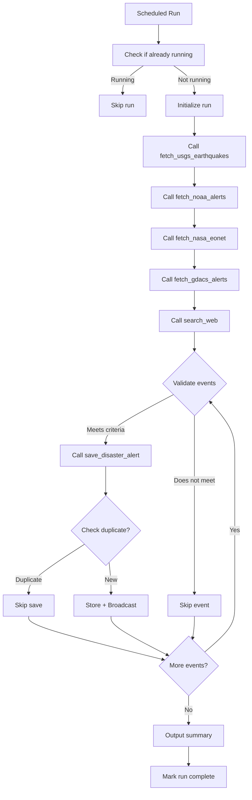

# Tech Stack

Sift is built with modern, reliable technologies chosen for rapid development, cross-platform support, and offline-first capabilities.

## Overview

| Layer | Technologies |
|-------|-------------|
| **Client** | React Native, JavaScript, BLE libraries, AsyncStorage |
| **Server** | Python, FastAPI, Uvicorn, APScheduler |
| **Data** | JSON files, USGS API, NOAA API, NASA EONET, GDACS RSS, Tavily API |
| **AI** | OpenAI SDK, Qwen3-30B-A3B (via H4H API) |
| **Communication** | WebSockets, Bluetooth Low Energy (GATT) |

---

## Client Stack

### React Native

<Card title="React Native 0.76.5" icon="react">
  Cross-platform mobile framework for Android and iOS
  
  **Why chosen:**
  - Single codebase for Android and iOS
  - Native Bluetooth Low Energy support via community libraries
  - Fast development with hot reload
  - Rich ecosystem for maps, storage, and networking
  
  **Package:** `react-native@0.76.5`
</Card>

### Core Dependencies

<AccordionGroup>
  <Accordion title="Networking & Communication">
    | Package | Version | Purpose |
    |---------|---------|----------|
    | `axios` | 1.7.7 | HTTP client for REST API calls to server |
    | WebSocket (built-in) | - | Real-time alert push from server |
  </Accordion>

  <Accordion title="Bluetooth Low Energy">
    | Package | Version | Purpose |
    |---------|---------|----------|
    | `react-native-ble-plx` | 3.1.2 | BLE central mode: scan, connect, read/write characteristics |
    | `react-native-multi-ble-peripheral` | 0.1.8 | BLE peripheral mode: advertise as discoverable device |
    
    **BLE Configuration:**
    - **Service UUID:** Custom GATT service for Sift alerts
    - **Characteristic UUID:** Custom characteristic for alert data transfer
    - **Device Name Prefix:** `Sift_` for discovery filtering
    - **MTU:** 512 bytes (requested during connection)
    
    **Location:** `Client/src/config/constants.js` (BLE_CONFIG)
  </Accordion>

  <Accordion title="Storage & State">
    | Package | Version | Purpose |
    |---------|---------|----------|
    | `@react-native-async-storage/async-storage` | 2.1.0 | Persistent local storage for alerts and settings |
    | `uuid` | 10.0.0 | Generate unique device and alert identifiers |
    | `react-native-get-random-values` | 1.11.0 | Polyfill for crypto.getRandomValues (required by uuid) |
    | `buffer` | 6.0.3 | Buffer polyfill for BLE base64 encoding/decoding |
  </Accordion>

  <Accordion title="UI & Maps">
    | Package | Version | Purpose |
    |---------|---------|----------|
    | `react` | 18.2.0 | React core library |
    | `react-native-webview` | 13.12.2 | Embed map views (if using web-based maps) |
    
    **Note:** Map implementation not visible in provided source files. Likely uses React Native Maps or similar.
  </Accordion>
</AccordionGroup>

### Build Tools

- **Metro Bundler:** `@react-native/metro-config@0.76.5`
- **Babel:** `@babel/core@7.25.2`, `@babel/preset-react@7.24.1`
- **React Native CLI:** `@react-native-community/cli@15.0.2`
- **Testing:** `jest@29.7.0`, `@testing-library/react-native@12.4.3`

### Platform Requirements

<CodeGroup>
```json Android Permissions (android/AndroidManifest.xml)
<uses-permission android:name="android.permission.BLUETOOTH" />
<uses-permission android:name="android.permission.BLUETOOTH_ADMIN" />
<uses-permission android:name="android.permission.BLUETOOTH_SCAN" /> <!-- API 31+ -->
<uses-permission android:name="android.permission.BLUETOOTH_CONNECT" /> <!-- API 31+ -->
<uses-permission android:name="android.permission.BLUETOOTH_ADVERTISE" /> <!-- API 31+ -->
<uses-permission android:name="android.permission.ACCESS_FINE_LOCATION" /> <!-- API <31 -->
<uses-permission android:name="android.permission.INTERNET" />
```

```json iOS Info.plist (ios/Info.plist)
<key>NSBluetoothAlwaysUsageDescription</key>
<string>Sift uses Bluetooth to share alerts with nearby devices when offline.</string>
<key>NSBluetoothPeripheralUsageDescription</key>
<string>Sift needs Bluetooth to broadcast alerts to nearby devices.</string>
<key>NSLocationWhenInUseUsageDescription</key>
<string>Sift uses your location to show nearby disaster alerts on the map.</string>
```
</CodeGroup>

---

## Server Stack

### Python & Web Framework

<Card title="FastAPI 0.111.0" icon="python">
  Modern, high-performance web framework for building APIs
  
  **Why chosen:**
  - Async/await support for concurrent operations
  - Built-in WebSocket support
  - Automatic OpenAPI documentation
  - Pydantic integration for type safety
  - Fast development with auto-reload
  
  **Package:** `fastapi==0.111.0`
</Card>

### Core Dependencies

<AccordionGroup>
  <Accordion title="Web Server & ASGI">
    | Package | Version | Purpose |
    |---------|---------|----------|
    | `uvicorn[standard]` | 0.30.1 | ASGI server with WebSocket support and auto-reload |
    | `python-multipart` | 0.0.9 | Form data parsing for file uploads |
  </Accordion>

  <Accordion title="Data Validation & Settings">
    | Package | Version | Purpose |
    |---------|---------|----------|
    | `pydantic` | 2.8.2 | Data validation and serialization with type hints |
    | `pydantic-settings` | 2.3.4 | Settings management from environment variables |
    | `python-dotenv` | 1.0.1 | Load environment variables from `.env` file |
    
    **Configuration Location:** `server/app/config.py`
    
    **Environment Variables:**
    - `H4H_API_KEY` — API key for H4H (Qwen3 LLM)
    - `H4H_BASE_URL` — Base URL for H4H API
    - `TAVILY_API_KEY` — API key for Tavily web search
    - `AGENT_INTERVAL_MINUTES` — Disaster agent run interval (default: configurable)
  </Accordion>

  <Accordion title="HTTP Client & Data Sources">
    | Package | Version | Purpose |
    |---------|---------|----------|
    | `httpx` | 0.27.0 | Async HTTP client for fetching from USGS, NOAA, NASA EONET |
    | `feedparser` | 6.0.11 | Parse GDACS RSS feed for disaster alerts |
    | `tavily-python` | 0.3.3 | Tavily SDK for AI-powered web search |
  </Accordion>

  <Accordion title="AI & Scheduling">
    | Package | Version | Purpose |
    |---------|---------|----------|
    | `openai` | 1.35.0 | OpenAI SDK (used with H4H API for Qwen3-30B-A3B) |
    | `apscheduler` | 3.10.4+ | Scheduled background jobs for disaster agent |
    
    **AI Model:** Qwen3-30B-A3B (Alibaba's Qwen 3 30B parameter model)
    
    **Scheduler Configuration:**
    - Timezone: UTC
    - Trigger: Interval (configurable minutes)
    - Misfire grace time: 60 seconds
    
    **Location:** `server/app/main.py:73`
  </Accordion>
</AccordionGroup>

### Data Sources APIs

<CardGroup cols={2}>
  <Card title="USGS Earthquake API" icon="earth-americas">
    **Endpoint:** `https://earthquake.usgs.gov/earthquakes/feed/v1.0/summary/4.5_hour.geojson`
    
    **Data:**
    - Magnitude 4.5+ earthquakes from last hour
    - Geographic coordinates, depth, magnitude
    - Real-time GeoJSON feed
    
    **No API key required**
    
    **Location:** `server/app/services/data_sources.py:21`
  </Card>

  <Card title="NOAA Weather Alerts" icon="cloud-bolt">
    **Endpoint:** `https://api.weather.gov/alerts/active?status=actual&message_type=alert`
    
    **Data:**
    - Active weather alerts (US only)
    - Filters: Moderate, Severe, Extreme severity
    - Floods, storms, tornadoes, hurricanes
    
    **No API key required**
    
    **Location:** `server/app/services/data_sources.py:57`
  </Card>

  <Card title="NASA EONET" icon="satellite">
    **Endpoint:** `https://eonet.gsfc.nasa.gov/api/v3/events?status=open&days=1&limit=20`
    
    **Data:**
    - Open natural events (global)
    - Wildfires, volcanoes, severe storms
    - Last 1 day, up to 20 events
    
    **No API key required**
    
    **Location:** `server/app/services/data_sources.py:138`
  </Card>

  <Card title="GDACS Global Alerts" icon="globe">
    **Endpoint:** `https://www.gdacs.org/xml/rss.xml`
    
    **Data:**
    - Global disaster alerts (RSS feed)
    - Red/Orange level alerts only
    - Earthquakes, floods, cyclones, tsunamis
    
    **No API key required**
    
    **Location:** `server/app/services/data_sources.py:193`
  </Card>

  <Card title="Tavily Web Search" icon="magnifying-glass">
    **SDK:** `tavily-python@0.3.3`
    
    **Data:**
    - Recent disaster news from trusted sources
    - Filtered to authoritative domains (Reuters, AP, BBC, USGS, NOAA, etc.)
    - Max 5 results per search
    
    **Requires API key** (`TAVILY_API_KEY`)
    
    **Location:** `server/app/services/disaster_agent.py:388`
  </Card>
</CardGroup>

---

## AI & LLM Stack

### Disaster Agent Architecture

<Card title="Qwen3-30B-A3B (via H4H API)" icon="brain">
  Alibaba's Qwen 3 30B parameter model, accessed via OpenAI-compatible API
  
  **Configuration:**
  ```python
  client = OpenAI(
      api_key=settings.h4h_api_key,
      base_url=settings.h4h_base_url,
  )
  
  response = client.chat.completions.create(
      model="Qwen3-30B-A3B",
      messages=messages,
      tools=TOOLS,
      tool_choice="auto",
      max_tokens=4096,
      temperature=0.1,
  )
  ```
  
  **Why Qwen3:**
  - Strong tool/function calling capabilities
  - Low temperature (0.1) for factual, deterministic responses
  - 30B parameters provide good reasoning for disaster classification
  - OpenAI SDK compatibility for easy integration
  
  **Location:** `server/app/services/disaster_agent.py:222`
</Card>

### AI Agent Tools

The disaster agent has access to 6 function tools:

1. **`fetch_usgs_earthquakes()`** — Fetch M4.5+ earthquakes from USGS
2. **`fetch_noaa_alerts()`** — Fetch Moderate/Severe/Extreme weather alerts from NOAA
3. **`fetch_nasa_eonet()`** — Fetch open natural events from NASA EONET
4. **`fetch_gdacs_alerts()`** — Fetch Red/Orange global alerts from GDACS
5. **`search_web(query: str)`** — Search web for recent disaster news via Tavily
6. **`save_disaster_alert(...)`** — Save validated alert to JSON storage and broadcast

**Location:** `server/app/services/disaster_agent.py:49` (TOOLS definition)

### Agent Logic Flow



**Deduplication Logic:**
- Same alert type within 50km radius
- Within 2-hour time window
- Haversine distance calculation

**Location:** `server/app/services/disaster_agent.py:479`

---

## Communication Protocols

### WebSocket

<Card title="WebSocket (ws/wss)" icon="tower-broadcast">
  **Server → Client only** (receive-only connection from client perspective)
  
  **Endpoint:** `ws://server:port/ws?deviceId={uuid}`
  
  **Message Format:**
  ```json
  {
    "event": "alert:new",
    "alert": { /* alert object */ }
  }
  ```
  
  **Reconnection:**
  - Client-side automatic reconnection
  - 5-second delay between attempts
  - Server enforces one connection per device
  
  **Implementation:**
  - Server: FastAPI WebSocket endpoint
  - Client: Native WebSocket API
  
  **Locations:**
  - Server: `server/app/main.py:140`
  - Client: `Client/src/services/websocketService.js:27`
</Card>

### Bluetooth Low Energy (BLE)

<Card title="BLE GATT Protocol" icon="bluetooth">
  **Peer-to-peer mesh networking for offline scenarios**
  
  **Configuration:**
  - **Service UUID:** Custom GATT service (defined in constants)
  - **Characteristic UUID:** Custom characteristic for alert data
  - **Device Name:** `Sift_{uuid}` for discovery
  - **MTU:** 512 bytes (negotiated on connect)
  - **Encoding:** Base64-encoded JSON
  
  **Modes:**
  1. **Central Mode** (scanner/client)
     - Scans for nearby `Sift_` devices
     - Connects and monitors characteristic for alerts
     - Library: `react-native-ble-plx`
  
  2. **Peripheral Mode** (advertiser/server)
     - Advertises as `Sift_{uuid}`
     - Writes alerts to characteristic when notified
     - Library: `react-native-multi-ble-peripheral`
  
  **Relay Logic:**
  - Each device acts as both central and peripheral
  - Alerts include `relayed_by` and `hop_count`
  - Prevents infinite loops via deduplication
  
  **Locations:**
  - Central: `Client/src/services/bluetoothService.js:12`
  - Peripheral: `Client/src/services/blePeripheralService.js`
</Card>

---

## Development Tools

### Server Development

```bash
# Virtual environment
python3 -m venv venv
source venv/bin/activate  # Windows: venv\Scripts\activate

# Install dependencies
pip install -r requirements.txt

# Run with auto-reload
uvicorn app.main:app --reload --port 8000
```

**Auto-generated docs:**
- Swagger UI: `http://localhost:8000/docs`
- ReDoc: `http://localhost:8000/redoc`

### Client Development

```bash
# Install dependencies
npm install

# Start Metro bundler
npm start

# Run on Android
npm run android

# Run on iOS
npm run ios
```

**Node version:** 18+ (specified in `package.json` engines)

---

## Infrastructure Requirements

<Warning>
Current deployment is optimized for **development/hackathon use**. Production deployments require additional infrastructure.
</Warning>

### Minimum Requirements

| Component | Requirement |
|-----------|------------|
| **Server OS** | Linux (Ubuntu/Debian recommended) |
| **Python** | 3.10+ |
| **Node.js** | 18+ |
| **Memory** | 512MB+ (agent runs can spike to 1GB) |
| **Storage** | 1GB+ (JSON files grow with alerts) |
| **Network** | Public IP for WebSocket, open port (e.g. 8000/8001) |

### Firewall Configuration

```bash
# Allow server port
sudo ufw allow 8001/tcp
sudo ufw reload

# Cloud provider: add inbound rule for TCP 8001
```

### Environment Setup

<CodeGroup>
```bash .env (server)
H4H_API_KEY=your_h4h_api_key_here
H4H_BASE_URL=https://api.h4h.example.com/v1
TAVILY_API_KEY=your_tavily_api_key_here
AGENT_INTERVAL_MINUTES=30
```

```javascript constants.js (client)
export const APP_CONFIG = {
  CENTRAL_SERVER_URL: 'http://YOUR_SERVER_IP:8001',
  DEBUG_MODE: __DEV__,
};
```
</CodeGroup>

---

## Next Steps

<CardGroup cols={2}>
  <Card title="Architecture Overview" icon="sitemap" href="/architecture/overview">
    High-level system architecture and component interaction
  </Card>

  <Card title="Data Flow" icon="diagram-project" href="/architecture/data-flow">
    Complete data flow from sources → agent → server → clients
  </Card>
</CardGroup>