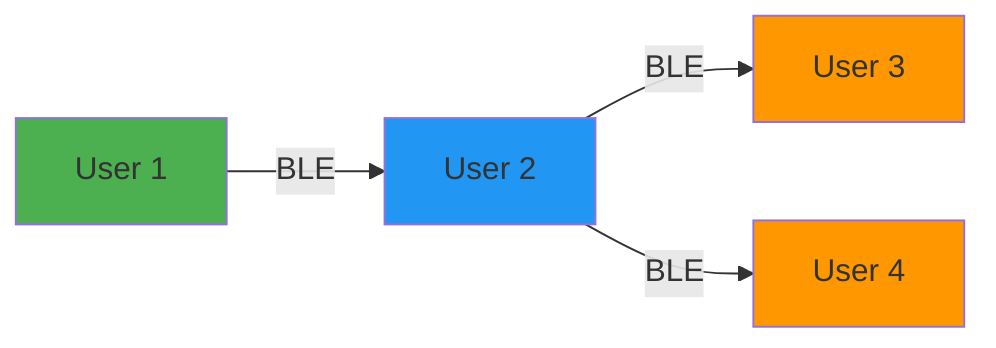

# Peer-to-Peer Chat

Sift includes a decentralized peer-to-peer chat system that allows users to communicate with nearby devices over Bluetooth Low Energy (BLE) when internet connectivity is limited or unavailable.

---

## How It Works

The chat feature uses the same BLE mesh infrastructure as alert sharing, allowing messages to be exchanged directly between devices without requiring server connectivity.

### Message Format

Chat messages are transmitted as JSON objects with a `_type` field set to `"chat"`:

```javascript Client/App.js:358
const msg = {
  _type: 'chat',
  id: uuid.v4(),
  sender: deviceId,
  text: text,
  ts: Date.now(),
};
```

<ParamField path="_type" type="string">
  Message type identifier (always `"chat"` for chat messages)
</ParamField>

<ParamField path="id" type="string">
  Unique message ID (UUID v4)
</ParamField>

<ParamField path="sender" type="string">
  Device ID of the message sender
</ParamField>

<ParamField path="text" type="string">
  Message content
</ParamField>

<ParamField path="ts" type="number">
  Unix timestamp (milliseconds)
</ParamField>

---

## Sending Messages

Messages are broadcast to all connected BLE peers:

```javascript Client/App.js:350
const sendChatMessage = useCallback(async () => {
  const text = (chatInput || '').trim();
  if (!text) return;
  
  if (bluetoothService._connectedDevices.size === 0) {
    Alert.alert('No peers', 'No BLE devices connected. Connect to peers to send messages.');
    return;
  }
  
  const msg = {
    _type: 'chat',
    id: uuid.v4(),
    sender: deviceId,
    text: text,
    ts: Date.now(),
  };
  
  try {
    chatMessageIdsRef.current.add(msg.id);
    await localStorage.addChatMessage(msg);
    await bluetoothService.broadcastAlert(msg);  // Reuses alert broadcast
    setChatInput('');
  } catch (e) {
    console.warn('[App] sendChatMessage failed', e?.message);
    Alert.alert('Send failed', e?.message || 'Could not send message.');
  }
}, [chatInput]);
```

<Note>
  The chat system reuses the same `broadcastAlert()` method used for disaster alerts. The `_type` field distinguishes chat messages from alert messages.
</Note>

---

## Receiving Messages

Chat messages are received through both the BLE Central and Peripheral services:

<CodeGroup>
```javascript BLE Central (scanning)
bluetoothService.onAlert((data) => {
  if (data && data._type === 'chat') {
    processChatMessage(data);
  }
});
```

```javascript BLE Peripheral (advertising)
blePeripheralService.onWrite((data) => {
  if (data && data._type === 'chat') {
    processChatMessage(data);
  }
});
```
</CodeGroup>

### Deduplication

Messages are deduplicated by ID to prevent showing the same message multiple times:

```javascript Client/App.js:336
const processChatMessage = useCallback(async (data) => {
  if (!data || data._type !== 'chat' || !data.id) return;
  if (chatMessageIdsRef.current.has(data.id)) return;  // Already seen
  chatMessageIdsRef.current.add(data.id);
  
  await localStorage.addChatMessage(data);
  setChatMessages((prev) => [...prev, data]);
}, []);
```

---

## Storage

Chat messages are persisted in AsyncStorage:

```javascript Client/src/config/constants.js:41
LOCAL_CHAT_MESSAGES: '@sift/local_chat_messages',
```

Messages are stored as JSON arrays with a configurable limit:

```javascript Client/src/config/constants.js:51
MAX_CHAT_MESSAGES: 200,  // Keep last 200 messages
```

### Storage Methods

<CodeGroup>
```javascript Add Message
async addChatMessage(msg) {
  const raw = await AsyncStorage.getItem(LOCAL_CHAT_MESSAGES);
  const messages = raw ? JSON.parse(raw) : [];
  messages.push(msg);
  const trimmed = messages.slice(-MAX_CHAT_MESSAGES);
  await AsyncStorage.setItem(LOCAL_CHAT_MESSAGES, JSON.stringify(trimmed));
  return trimmed;
}
```

```javascript Get Messages
async getLatestChatMessages(limit = 50) {
  const raw = await AsyncStorage.getItem(LOCAL_CHAT_MESSAGES);
  const messages = raw ? JSON.parse(raw) : [];
  const n = Math.min(limit, messages.length);
  return messages.slice(-n).reverse();
}
```
</CodeGroup>

**Location:** `Client/src/store/localStorage.js:120-150`

---

## User Interface

The chat interface is accessible from the Messages tab in the app:

```javascript Client/App.js:574
{view === 'messages' && (
  <View style={styles.messagesContainer}>
    <ScrollView
      ref={chatScrollRef}
      style={styles.chatList}
      contentContainerStyle={styles.chatListContent}
    >
      {chatMessages.map((msg) => (
        <View key={msg.id} style={styles.chatMessageCard}>
          <View style={styles.chatMessageHeader}>
            <Text style={styles.chatMessageSender}>{msg.sender}</Text>
            <Text style={styles.chatMessageTime}>{formatTime(msg.ts)}</Text>
          </View>
          <Text style={styles.chatMessageText}>{msg.text}</Text>
        </View>
      ))}
    </ScrollView>
    
    <View style={styles.chatInputRow}>
      <TextInput
        style={styles.chatInput}
        placeholder="Type a message…"
        value={chatInput}
        onChangeText={setChatInput}
      />
      <TouchableOpacity
        style={styles.chatSendButton}
        onPress={sendChatMessage}
      >
        <Text style={styles.chatSendButtonText}>Send</Text>
      </TouchableOpacity>
    </View>
  </View>
)}
```

---

## Range and Topology

Chat messages follow the same propagation rules as disaster alerts:

- **Direct range:** 10-50 meters (typical BLE range)
- **Multi-hop:** Messages can relay through intermediate devices
- **Hop count:** Not tracked for chat messages (unlike alerts)



---

## Use Cases

<CardGroup cols={2}>
  <Card title="Disaster Coordination" icon="people-group">
    Coordinate rescue efforts or resource sharing when cellular networks are down
  </Card>
  
  <Card title="Emergency Communication" icon="walkie-talkie">
    Send status updates or request help without internet connectivity
  </Card>
  
  <Card title="Community Updates" icon="bullhorn">
    Share local information about conditions, hazards, or resources
  </Card>
  
  <Card title="Group Messaging" icon="users">
    Communicate with nearby devices in a decentralized mesh network
  </Card>
</CardGroup>

---

## Limitations

<Warning>
  Chat messages are **not encrypted**. Do not send sensitive or personal information.
</Warning>

<Info>
  Messages are only delivered to devices within BLE range or connected through the mesh. There is no message delivery guarantee or read receipt system.
</Info>

<Tip>
  Keep messages short (under 200 characters) for better transmission reliability over BLE.
</Tip>

---

## Next Steps

<CardGroup cols={2}>
  <Card title="BLE Mesh" icon="network-wired" href="/features/ble-mesh">
    Learn about the underlying BLE infrastructure
  </Card>
  
  <Card title="Configuration" icon="gear" href="/deployment/configuration">
    Configure chat message limits and storage
  </Card>
</CardGroup>
